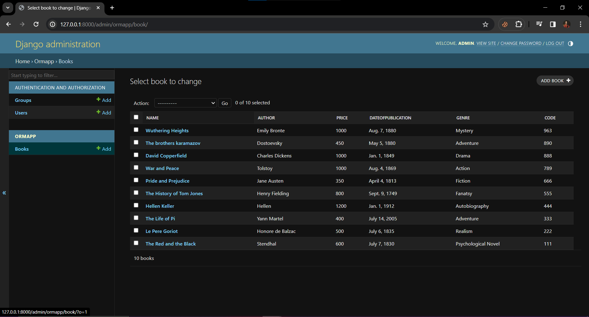

# Ex02 Django ORM Web Application
## Date: 04-04-2024

## AIM
To develop a Django application to store and retrieve data from a Book database using Object Relational Mapping(ORM).


## DESIGN STEPS

### STEP 1:
Clone the problem from GitHub

### STEP 2:
Create a new app in Django project

### STEP 3:
Enter the code for admin.py and models.py

### STEP 4:
Execute Django admin and create details for 10 books

## PROGRAM
```
admin.py

from django.contrib import admin
from .models import Book, BookAdmin

admin.site.register(Book, BookAdmin)

models.py

from django.db import models
from django.contrib import admin

class Book(models.Model):
    name = models.CharField(max_length=50)
    author = models.CharField(max_length=20)
    price = models.IntegerField()
    dateofpublication = models.DateField()
    genre = models.CharField(max_length=30)
    code = models.CharField(max_length=20, primary_key=True)

class BookAdmin(admin.ModelAdmin):
    list_display = ("name", "author", "price", "dateofpublication", "genre", "code")

```
## OUTPUT



## RESULT
Thus the program for creating a database using ORM hass been executed successfully
